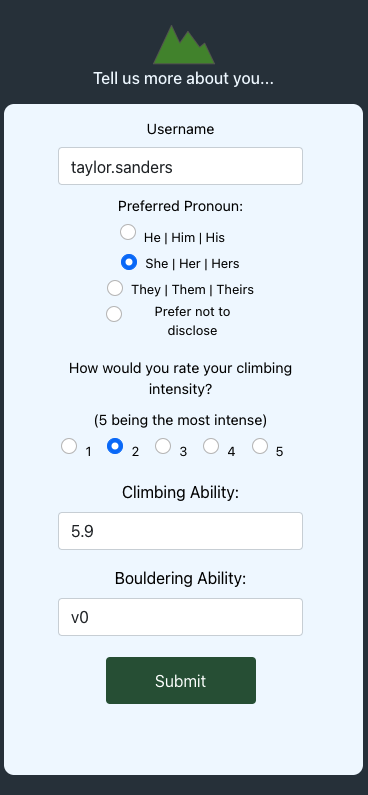

# Lets+Venture  
<!--  -->
An Adventure application allowing people to keep track of there trips, skills and like-friends

#
# Table of Contents
* [Description](#Description)
* [Features](#Features)
* [Technologies](#Technologies)
* [Usage](#Usage)
* [Future_Development](#Future_Development)
* [Contributors](#Contributors)
## Description 
As rock climber I am frequently looking for new challenges and new friends to climb with. This is an app to help users connect to like-minded, similarly-skilled climbers and find each other meet for climbs and socialize.

 
 

#
## Features
- Ability to save recent climbs to a favorites list
- Pinpoint locations using Maps
- View and update personal profile
    * Climbing Ability
    * Bouldering Ability
    * Recent Climbs
- View friends profile
- Update Climbs with achievements 
 

#
## Technologies
- Axios
- Cloudinary for images
- Geo Code
- Google Login
- Google Map
- Deployment via Heroku server, Netlify client
- MySql DB
- Auth0
- React Bootstrap
- Sequelize  
#
## Usage
As a user, I am able to keep track of my climbing history, success and achievements. This app allows me to save recent climbs, find new climbs and plan future climbs. I am also able and able to add to my profile my skill level. Additionally I am able to find new friends and climbing partners and share my success with them.
#
## Future
- Messaging
- Additional Map Functionality 
    * Detailed Markers
    * Ability to Comment, Review, and Submit Photos of Climbs
    * Surfing
- Upcoming Climbing Competition
- Trail work parties
#
## Contributors
- Page W Black 
    * Email: mursepage@gmail.com
    * [GitHub](https://github.com/noheropage)
- Mikey Perara
    * Email: peraram2@gmail.com
    * [GitHub](https://github.com/MikeyP957)
- Taylor Sanders
    * Email: tsanders3515@gmail.com
    * [GitHub](https://github.com/justpeachy8688)
- Nick Rider
    * Email: rnick0260@gmail.com
    * [GitHub](https://github.com/rnick1)
- Adam Stevenson
    * Email: adamscdcm@gmail.com
    * [GitHub](https://github.com/adams1971)